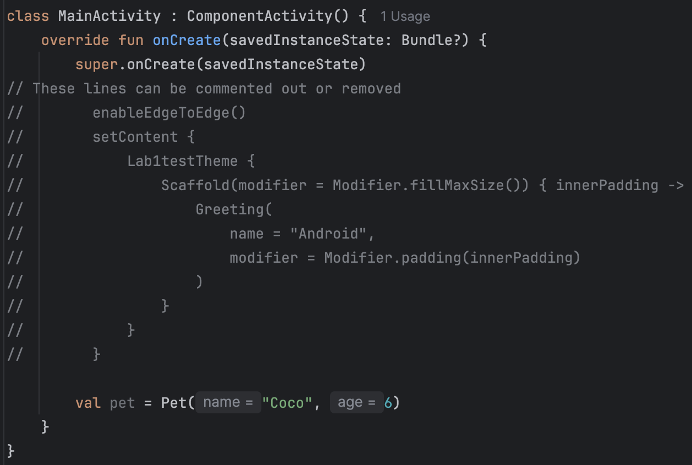

# CMPUT 301 - Lab 1: Kotlin, OOP, and Android Studio!

## 1. Setup Instructions

1. Download and install Android Studio from the [official Android website](https://developer.android.com/studio).

2. Refer to the [installation guide](https://developer.android.com/studio/install) unique to your Operating System.

3. Refer to the lab 1 slides for information about how the labs will work.

## 2. Walkthrough
1. Create a new `PetShop` project on Android Studio (File > New > New Project > Select "Empty Activity").

> [!WARNING]
> Make sure that the project language is **Kotlin**, not Java!

2. Create a new `Pet` class by navigating to File > New > Kotlin Class/File
3. Create a primary constructor for the `Pet` class, with the following attributes:
    - `String name`
    - `Int age`
<br></br>
    ```kotlin
    class Pet(val name: String, var age: Int) 
    ```
   
    > Use Alt + Enter (Windows) or Option + Return (Mac) to import any packages

> [!IMPORTANT]
> Access modifiers:
> - `public` : universal access
> - `private` : class-only access
> - `protected` : package and inheritance access
> - `No modifier` : public by default in Kotlin
>
> Variable declaration:
> - `val` : read-only
> - `var` : read-write  

4. Instantiate a `Pet` in MainActivity by passing in `String name` and `Int age` arguments:

    > For example:
    ```kotlin
    val pet = Pet("Coco", 6)
    ```
<div style="display: flex; flex-wrap: wrap; justify-content: center;">
    

5. Make a `Cat` subclass of `Pet`
    - Add the keyword `open` to the `Pet` class to allow inheritance and overriding
    ```kotlin
    open class Pet(val name: String, var age: Int)
    ```

    - Create a new `Cat` class by navigating to File > New > Kotlin Class/File
    - Create a `Cat` child class that extends the `Pet` class, defining the superclass constructor for `Cat`
    ```kotlin
    class Cat(name: String, age: Int): Pet(name, age) 
    ```

6. Make the Pet Class Abstract
    - Change the `Pet` class declaration to the following:
    ```kotlin
    abstract class Pet(val name: String, var age: Int)
    ```

> [!NOTE]
> Abstract classes cannot be instantiated directly - they can only be used as base classes for inheritance. You must create concrete subclasses to create objects.

7. Continue Updating the Pet Class
    - Change the `Pet` to a `Cat` in MainActivity
    ```kotlin
    val cat = Cat("Coco", 6)
    ```

    - Add an abstract method for speaking in the `Pet` class. It has no implementation and must be overridden by a child class to add functionality
    ```kotlin
    abstract class Pet(val name: String, var age: Int) {
        abstract fun speak(): String
    }
    ```

> [!NOTE]
> Abstract methods have no implementation and cannot be called directly. They must be overridden by concrete subclasses before they can be used through objects of those subclasses.

8. Method Overriding
    - `Cat` must override the abstract `speak()` method from the `Pet` class, using the `override` keyword
    - Each child class can implement `speak()` differently based on its needs

    ```kotlin
    class Cat(name: String, age: Int): Pet(name, age) {
        override fun speak(): String {
            return "Meow"
        }
    }
    ```

9. Make a `Dog` subclass of `Pet`
    - This will be similar to what we did for the `Cat` subclass
    - `speak()` method should return `"bark"`
   
    ```kotlin
    class Dog(name: String, age: Int): Pet(name, age) {
        override fun speak(): String {
            return "bark"
        }
    }
    ```

    - Add an instantiation of `Dog` in MainActivity
    ```kotlin
    val dog = Dog("Mochi", 6)
    ```
    
    - How can we create a list of these pets in MainActivity? (Hint - implicit upcasting)
    ```kotlin
    val pets = mutableListOf<Pet>()
    pets.add(cat)
    pets.add(dog)
    ```
    OR
    ```kotlin
    val pets = mutableListOf(cat, dog)
    ```

10. Make a `Scorpion` subclass of `Pet`
    - `speak()` method should return `"hiss"`
    ```kotlin
    class Scorpion(name: String, age: Int): Pet(name, age) {
        override fun speak(): String {
            return "hiss"
        }
    }
    ```
    
    - Add scorpion to our list of Pets in MainActivity:
    ```kotlin
    val scorpion = Scorpion("Stinger", 32)
    ```
    - Add the following to `MainActivity`:
    ```kotlin
    pets.add(scorpion)
    ```
    or
    ```kotlin
    val pets = mutableListOf(cat, dog, scorpion)
    ```
    

12. Interface Implementation
    - Abstract method and base class so all the classes have the `speak()` method
    - An interface can also be used to force the use of some methods
    ```kotlin
    interface Pettable {
        fun pet()
    }
    ```
   
    - `Pet` should not implement `Pettable` because `Scorpion` should not be pettable
    - Make `Cat` and `Dog` classes implement `Pettable` class
<br></br>
    > For example, for `Cat`:
    ```kotlin
    class Cat(name: String, age: Int): Pet(name, age), Pettable {
        ...
    }
    ```
    
    - All classes that implement this interface **must** provide implementations for these methods
<br></br>
    > For example, in the `Cat` class:
    ```kotlin
    override fun pet() {
        println("The cat $name is being petted")
    }
    ```

    - Let's create a list of our pettable pets in MainActivity
    ```kotlin
    val pettablePets = mutableListOf<Pettable>()
    pettablePets.add(cat)
    pettablePets.add(dog)
    pettablePets.add(scorpion) // should raise an error
    ```
    or
    ```kotlin
    val pettablePets = mutableListOf<Pettable>(cat, dog, scorpion)
    ```

## 3. Lab 1 Participation Exercise
1. Add three new model classes to `PetShop`:
   - An abstract base class which represents the current `Mood`
   - Two non-abstract classes which represent different moods (Ex: happy, sad, etc.) and inherit from the abstract class    
2. Each mood should have at least a date attribute of type `String`
3. Each mood should have a method that returns a string representing that mood
   - Hint: the abstract class should provide an abstract method for the subclasses to override, and provide a concrete implementation for    

## 4. Submission Specifications
1. Fork and then clone this repository
    - Make sure your forked repository is **public**
    - Hint: Use `git clone`
3. Add your `PetShop` Android Studio Project to your forked repository
    - Hint: Use `git add`, `git commit`, and `git push`
4. Update the `README.md` file with your details and references/collaborators
5. Update the `LICENSE.md` file with your full name
6. Submit the link to your GitHub repository on Canvas

> [!IMPORTANT]
> - This lab is graded on a complete/incomplete basis. You will receive a “complete” if you finish the walkthrough, complete the participation exercise, and follow ALL submission requirements. You will receive an “incomplete” if any of these requirements are not met, such as an inaccessible (non-public) repository, missing participation exercise, or an incorrect submission.
> - **There will be no exceptions, partial marks, or late submissions allowed.**
